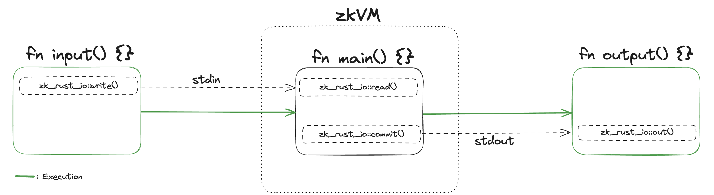

# zkRust

`zkRust` is a CLI tool to simplify developing zk applications in Rust using zkVM's such as SP1 or Risc0.

`zkRust` simplifies the development experience of using zkVM's by abstracting the complexity of using zkVM's from the developer and providing them the choice of which zkVM they would like to develop with.

## Installation:
First make sure [Rust](https://www.rust-lang.org/tools/install) is installed on your machine. 


zkRust can also be installed directly by downloading the latest release binaries.

```sh
curl -L https://raw.githubusercontent.com/yetanotherco/zkRust/main/install_zkrust.sh | bash
```

for local development install the repository dependencies.

```sh
make install
```

## Quickstart

To get started you can create a workspace for your project in zkRust by running:

```sh
cargo new <PROGRAM_DIRECTORY>
```

You can test zkRust for any of the examples in the `examples` folder. This include programs for:

- Computing and reading the results of computing Fibonacci numbers.
- Performing RSA key verification.
- Performing ECDSA program.
- Verification of a blockchain state diff.
- Computing the Sha256 hash of a value.
- Verifying a tendermint block.
- Interacting with a user to answer a quiz.

## Usage:

To use zkRust, users must specify a `main()` function whose execution is proven within the zkVM. This function must be defined within a `main.rs` file in a directory with the following structure:

```
.
└── <PROGRAM_DIRECTORY>
    ├── Cargo.toml
    └── src
        └── main.rs
```

Projects can also store libraries in a separate `lib/` folder.

```
.
└── <PROGRAM_DIRECTORY>
    ├── Cargo.toml
    ├── lib/
    └── src
        └── main.rs
```

The user may also define a `input()`, `output()` functions, in addition to `main()`. The `input()` and `output()` functions define code that runs outside of the zkVM before and after the zkVM generates a proof of the users program. The `input()` function executes before the zkVM code is executed and allows the user to define inputs passed to the VM such as a deserialized Tx or data fetched from an external source at runtime. Within the `main()` (guest) function the user may write information from the computation performed in the zkVM to an output buffer to be used after proof generation. The `output()` defines code that allows the user to read the information written to that buffer of the and perform post-processing of that data.



The user may specify (public) inputs into the VM (guest) code using `zk_rust_io::write()` as long on the type of Rust object they want to input into the VM implements [Serialize](https://docs.rs/serde/latest/serde/trait.Serialize.html). Within there `main()` function the user may read in these inputs to there program via `zk_rust_io::read()`. They can also output data computed during the execution phase of the code within the VM program by commiting it to the VM output via `zk_rust_io::commit()`. To read the output of the output of the VM program the user declares `zk_rust_io::out()`, which reads and deserializes the committed information from the VM output buffer.

The `zk_rust_io` crate defines function headers that are not inlined and are purely used as compile time symbols to ensure a user can compile there Rust code before running it within one of the zkVM available in zkRust.

To use the I/O imports import the `zk_rust_io` crate by adding the following to the `Cargo.toml` in your project directory.

```sh
zk_rust_io = { git = "https://github.com/yetanotherco/zkRust.git", tag = "v0.1.0" }
```

### input.rs

```rust
use zk_rust_io;

pub fn input() {
    let pattern = "a+".to_string();
    let target_string = "an era of truth, not trust".to_string();

    // Write in a simple regex pattern.
    zk_rust_io::write(&pattern);
    zk_rust_io::write(&target_string);
}
```

### main.rs

```rust
use regex::Regex;
use zk_rust_io;

pub fn main() {
    // Read two inputs from the prover: a regex pattern and a target string.
    let pattern: String = zk_rust_io::read();
    let target_string: String = zk_rust_io::read();

    // Try to compile the regex pattern. If it fails, write `false` as output and return.
    let regex = match Regex::new(&pattern) {
        Ok(regex) => regex,
        Err(_) => {
            panic!("Invalid regex pattern");
        }
    };

    // Perform the regex search on the target string.
    let result = regex.is_match(&target_string);

    // Write the result (true or false) to the output.
    zk_rust_io::commit(&result);
}
```

### output.rs

```rust
use zk_rust_io;

pub fn output() {
    // Read the output.
    let res: bool = zk_rust_io::out();
    println!("res: {}", res);
}
```

To generate a proof of the execution of your code run the following:

- **SP1**:
  ```sh
  cargo run --release -- prove-sp1 <PROGRAM_DIRECTORY_PATH>
  ```
- **Risc0**:
  ```sh
  cargo run --release -- prove-risc0  <PROGRAM_DIRECTORY_PATH>
  ```
  ***NOTE*** Currently Aligned supports verification of [Risc0](https://dev.risczero.com/api/zkvm/quickstart#1-install-the-risc-zero-toolchain) proofs from release version `v1.0.1`. 

To generate your proof and send it to [Aligned](https://github.com/yetanotherco/aligned_layer). First generate a local wallet keystore using `[cast](https://book.getfoundry.sh/cast/).

```sh
cast wallet new-mnemonic
```

Then you can import your created keystore using:

```sh
cast wallet import --interactive <PATH_TO_KEYSTORE.json>
```

Finally, to generate and send your proof of your programs execution to Aligned use the zkRust CLI with the `--submit-to-aligned` flag.

```sh
cargo run --release -- prove-sp1 <PROGRAM_DIRECTORY_PATH> --submit-to-aligned --keystore-path <PATH_TO_KEYSTORE>
```

### Flags

- `--submit-to-aligned`: Sends the proof to be verified on Aligned after proof generation. Requires an rpc url and keystore for a funded wallet specified via the `--rpc-url` and `--key_store` flags.

- `--keystore-path`: Path to the keystore of the users wallet. Defaults to `~/keystore`.

- `--rpc-url`: Specifies the rpc-url used for the user eth rpc-url. Defaults to `https://ethereum-holesky-rpc.publicnode.com`.

- `--network`: Chain ID number of the ethereum chain Aligned is deployed on. Defaults to `holesky`.

- `--precompiles`: Enables acceleration via precompiles for supported zkVM's. Specifying this flag allows for VM specific speedups for specific expensive operations such as SHA256, SHA3, bigint multiplication, and ed25519 signature verification. By specifying this flag proving operations for specific operations within the following rust crates are accelerated:

  - SP1:

    - sha2 v0.10.6
    - sha3 v0.10.8
    - crypto-bigint v0.5.5
    - tiny-keccak v2.0.2
    - ed25519-consensus v2.1.0
    - ecdsa-core v0.16.9

  - Risc0:
    - sha2 v0.10.6
    - k256 v0.13.1
    - crypto-bigint v0.5.5

After installing the binary and required un one of the following commands to test zkRust. You can choose either Risc0 or SP1:

**Fibonacci**:

```bash
make prove_risc0_fibonacci
```

```bash
make prove_sp1_fibonacci
```

**RSA**:

```bash
make prove_risc0_rsa
```

```bash
make prove_sp1_rsa
```

**ECDSA**:

```bash
make prove_risc0_ecdsa
```

```bash
make prove_sp1_ecdsa
```

**Blockchain State Diff**:

```bash
make prove_risc0_json
```

```bash
make prove_sp1_json
```

**Regex**:

```bash
make prove_risc0_regex
```

```bash
make prove_sp1_regex
```

**Sha**:

```bash
make prove_risc0_sha
```

```bash
make prove_sp1_sha
```

**Tendermint**:

```bash
make prove_risc0_tendermint
```

```bash
make prove_sp1_tendermint
```

**Zk Quiz**:

```bash
make prove_risc0_zkquiz
```

```bash
make prove_sp1_zkquiz
```

**NOTE**: for the precompiles to be included within the compilation step the crate version you are using must match the crate version above.

# Acknowledgments:

ZK Rust was intended and designed as a tool to make development on programs that use zkVM's easier and reduce deduplication of code for developers that want to experiment with zk on Aligned layer. We want the work and contributions of the SP1 and Risc0 teams to the field of Zero Knowledge Cryptography.

[SP1](https://github.com/succinctlabs/sp1.git)

[Risc0](https://github.com/risc0/risc0.git)
